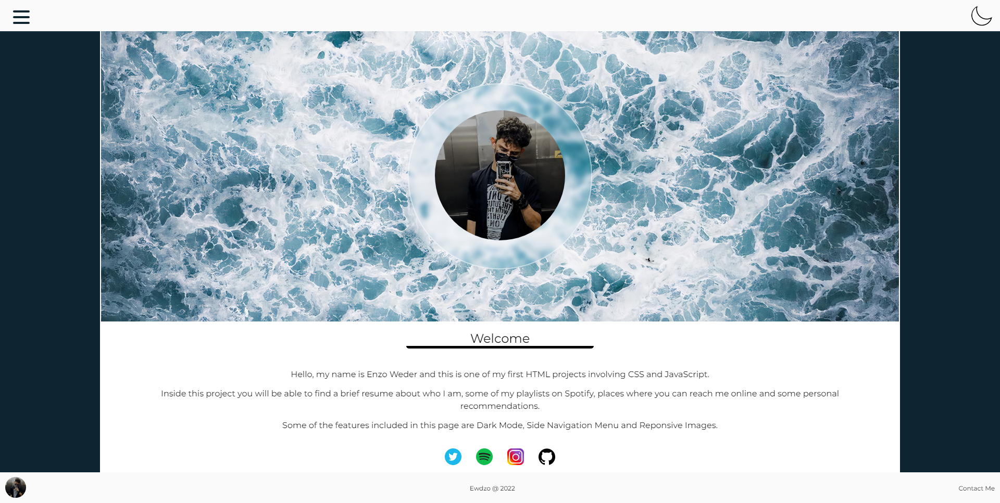
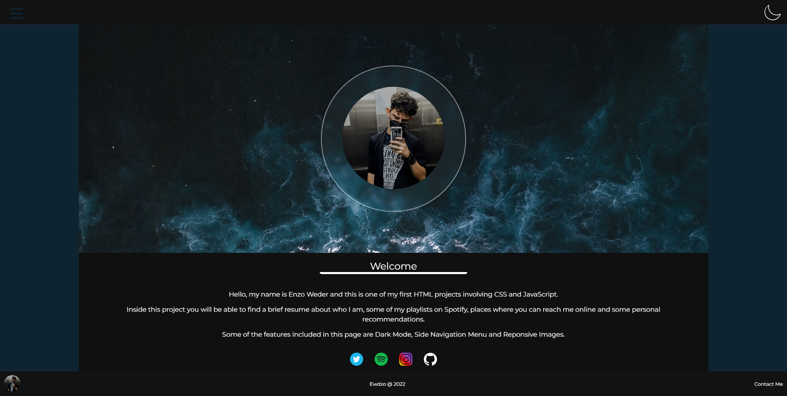
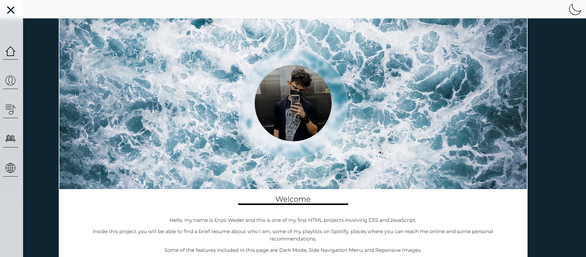
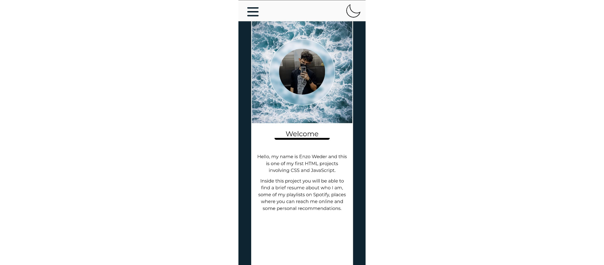

# FirstPage

Hello, my name is Enzo Weder. 

I have recently started Web-Programming classes and decided to do a project to see what and how much would I be able to do with what I know as of know.

<h1>Features:</h1>

Inside this project you will find:

<ul>
<li>Dark Mode</li>
<li>Side Navigation Menu</li>
<li>Mobile-Friendly Responsitivity</li>
<li>Responsive Images</li>
</ul>

---

</img>

---

</img>

---

</img>

---

</img>

---

</img>

---